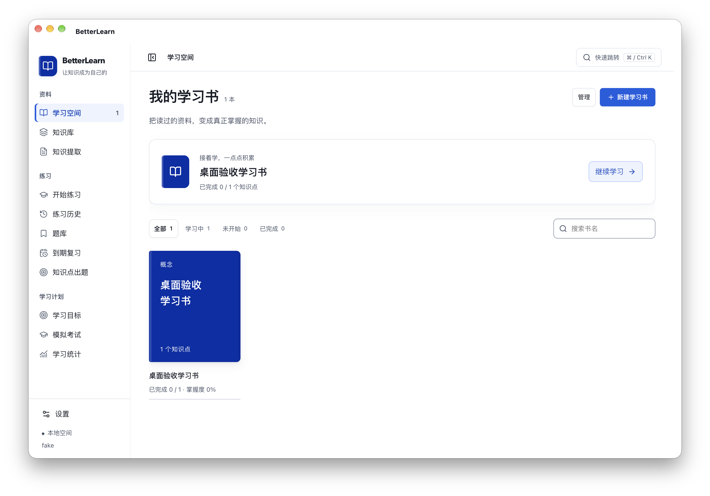
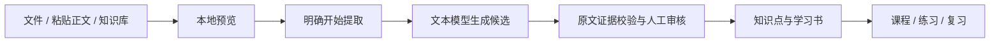
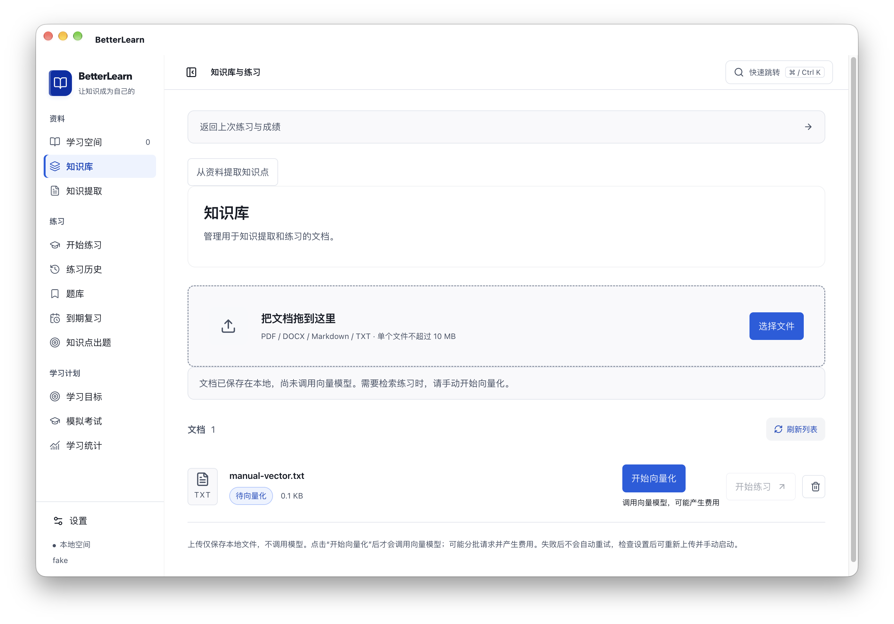
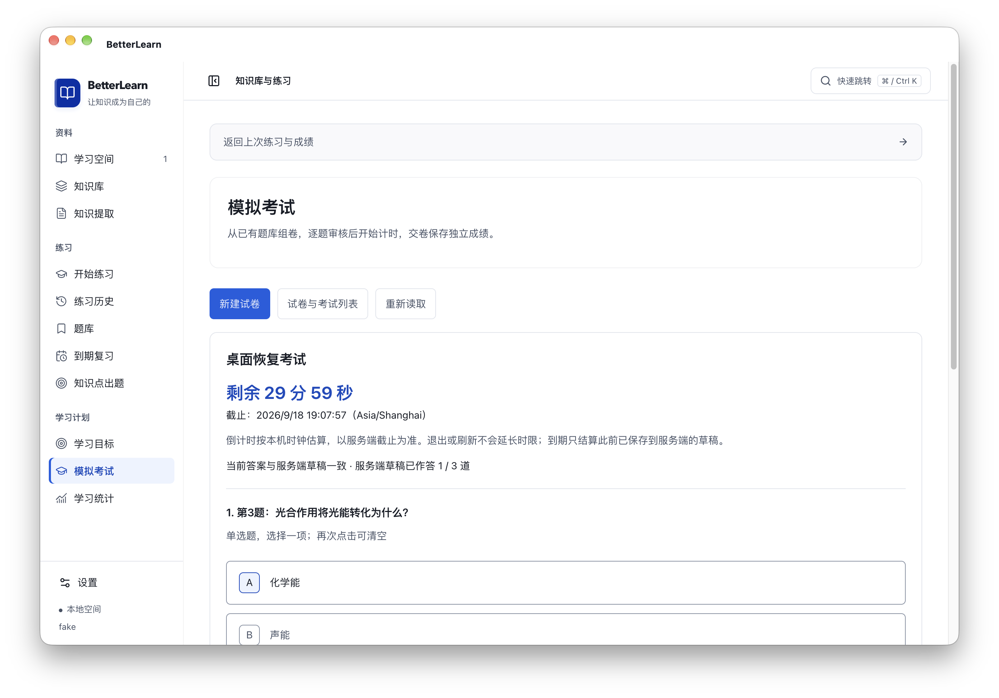

# BetterLearn · bl

[](https://github.com/Zer0Rin/bl/actions/workflows/ci.yml)
[](LICENSE)

**把读过的资料，变成真正掌握的知识。**

BetterLearn 是本机运行、单人使用的学习工作台：从资料中提取知识、核对原文证据，整理成学习书，再通过练习、复习和模拟考试检验理解。独立 Web 与 Electron 桌面版共用业务和本地数据，**无需 DSH 或 MySQL**。

[快速开始](#快速开始) · [功能展示](#功能展示) · [模型与费用](#模型与费用) · [使用指南](docs/learning-workflows.md) · [桌面说明](docs/desktop.md) · [MCP 与插件](docs/plugins.md)

## 功能展示

### 学习空间

用学习书管理经过审核的知识点，继续课程、查看进度，按关键词和学习状态筛选。侧边栏可以收起，`⌘ / Ctrl K` 快速跳转；背景和组件不透明度分别调节。



### 从资料到知识



| 功能 | 可以做什么 |
| --- | --- |
| 知识提取 | 导入材料、预览提取计划、分批处理长文、逐条核对证据、接受或修改候选 |
| 提取历史 | 保存任务与模型快照；返回导入页不删除任务，也不停止已经启动的后台提取 |
| 学习书与课程 | 将审核后的知识点组织成书，学习课程、记录进度、进入到期复习 |
| 知识库 | 保存 PDF、DOCX、Markdown、TXT 原件，读取连续正文，手动建立向量索引 |
| AI 练习 | 围绕主题、知识库文档或课程知识点出题，保存草稿、交卷和查看成绩 |
| 题库 | 查看错题、收藏、分类，管理题目来源及知识点关联 |
| 学习目标 | 为指定知识点版本设定期限和练习目标，查看有效作答证据 |
| 模拟考试 | 从已有题库组卷，预览缺口、审核覆盖、计时作答、恢复草稿并保存成绩 |
| 学习统计 | 查看知识点作答历史和证据统计；未作答题不计为学习证据 |
| AI 报告 | 交卷后按需生成；不自动调用模型生成报告 |
| MCP / 插件 | 通过 MCP 读取本地学习资料和记录，显式发起支持的生成任务；提供 Codex / Claude Code 包装 |

### 知识库：上传与向量化分开

上传只保存本地文件，显示“待向量化”。只有点击 **开始向量化** 才调用配置的向量模型；按钮旁显示费用提示。刷新、重启、失败不会自动启动或重试，重复请求不会重复启动同一文档任务。未向量化原件仍可用于文本知识提取。



### 模拟考试与学习反馈

组卷后先审核，再开始计时。草稿可恢复，交卷保存独立成绩；考试成绩和练习统计不会自动覆盖课程掌握度。目标统计按记录的交卷时间计算，截止前到期的考试稍后结算时仍可能更新目标结果。



> 截图来自真实 Electron 界面，使用隔离测试数据和模拟模型服务；不包含个人学习资料。截图采用较高背景不透明度，玻璃效果可在设置中调节。

## 模型与费用

使用自己的 API 服务和密钥。应用不是离线模型安装器；模型服务可能收费。

| 能力 | 用途 | 何时调用 |
| --- | --- | --- |
| 文本模型 | 知识提取、课程内容、AI 出题、报告 | 明确开始提取、生成或请求报告时 |
| 向量模型（Embedding） | 文档向量化、知识库语义检索 | 点击“开始向量化”；使用知识库检索时还可能产生查询向量调用 |
| 图片模型 | 练习配图 | 启用相应配图生成时 |
| 联网检索 | 外部信息检索 | 配置并启用后，在相关生成流程中按需调用 |

- 文本模型使用支持工具调用的 OpenAI 兼容接口，具体兼容性取决于服务提供方。
- 向量模型、图片模型与联网检索独立配置；不需要的能力可以不配置。
- 上传和提取预览不调用模型；长文提取和文档向量化可能分成多次请求。
- 提取失败后重新生成需明确操作，并提示额外调用；向量化失败不自动重试。
- 未配置模型时可以浏览已有学习数据。资料在调用外部模型时会发送到所配置的服务。

## 快速开始

仓库名为 **bl**，应用名称和默认数据目录仍为 BetterLearn / `~/.betterlearn-web`。

### 环境要求

| 项目 | 要求 |
| --- | --- |
| 源码运行 | Node.js 24+、Python 3.12、pnpm（通过 Corepack） |
| 后端平台 | macOS / Linux；Windows 尚未适配 |
| 打包桌面应用 | 自带 Electron / Node，仍需外部 Python 3.12 |
| 原生玻璃 | macOS 26+，构建原生模块需对应 SDK / Xcode；其他平台不保证同样效果 |

### Electron 桌面版

```bash
git clone https://github.com/Zer0Rin/bl.git
cd bl
corepack pnpm install --frozen-lockfile
corepack pnpm start:desktop
```

首次启动选择 Python 3.12，点击“准备学习环境”；程序会联网安装两个隔离的 Python 环境。完成后进入“设置”填写文本模型，其他能力按需配置。

生成本机安装包：

```bash
corepack pnpm pack:desktop
# 输出：dist/installers/
```

当前没有配置发行签名、公证和自动更新。macOS 本机验证使用 Apple Silicon DMG；其他平台的安装产物应在目标平台验证。详见 [桌面运行与打包](docs/desktop.md)。

### 独立 Web

在完成克隆和依赖安装后：

```bash
corepack pnpm build

# 替换为本机 Python 3.12 的绝对路径。
node dist/standalone/betterlearn.mjs init \
  --home "$HOME/.betterlearn-web" \
  --python /opt/homebrew/bin/python3.12

node dist/standalone/betterlearn.mjs start --home "$HOME/.betterlearn-web"
```

打开终端输出的地址，默认 `http://127.0.0.1:3210`。首次初始化安装依赖，正常启动不必再次安装。`corepack pnpm pack:web` 可生成可复制的独立 Web 包，详见 [Web 使用说明](docs/standalone-web.md)。

### MCP 与 Codex / Claude Code

先启动 BetterLearn，再将下面的 stdio 命令接入客户端：

```bash
node /absolute/path/to/bl/dist/standalone/mcp.mjs \
  --home /absolute/path/to/.betterlearn-web
```

MCP 连接已运行的本机服务，不另起一套学习后端。生成操作使用 BetterLearn 的模型配置，可能产生费用。完整工具、幂等要求与插件安装方法见 [MCP 文档](docs/mcp.md) 和 [插件文档](docs/plugins.md)。

## 数据与边界

- 本地单用户工作台：Core SQLite 保存提取、审核、学习书与课程；Quiz SQLite 保存练习、题库、目标与考试；Chroma 保存向量索引。
- 模型密钥保存在本机后端，页面只展示配置状态。接口只面向本机，不应暴露到公网。
- Web 与桌面共用数据目录，但不能同时占用同一个目录；浏览器草稿及外观偏好不保证跨宿主同步。
- PDF 仅支持文字层，当前不含 OCR。未审核的模型输出不会直接变成已确认知识。
- 题库统计、学习目标证据分数与课程掌握度含义不同，不互相自动覆盖。
- 新版本不会自动迁移旧 DSH / MySQL 数据。数据库升级保留备份；已有向量不会因本次升级重新生成。

退出应用后备份：

```bash
node dist/standalone/betterlearn.mjs backup \
  --home "$HOME/.betterlearn-web" --to /absolute/path/to/new-backup
node dist/standalone/betterlearn.mjs restore \
  --home /absolute/path/to/new-home --from /absolute/path/to/new-backup
```

恢复目标必须是新目录；之后在目标目录运行 `init` 准备 Python 环境。备份含私有模型配置，请妥善保管。

## 开发与验证

```bash
python3.12 -m venv .venv-phase1b
.venv-phase1b/bin/python -m pip install -r python/requirements-phase1-dev.lock
python3.12 -m venv services/quiz/.venv
services/quiz/.venv/bin/python -m pip install -r services/quiz/requirements.txt

corepack pnpm test
corepack pnpm test:core
corepack pnpm test:quiz
corepack pnpm test:desktop
corepack pnpm test:plugins
```

自动测试使用临时数据库、真实本地服务与模拟模型，不调用收费模型。桌面测试打开真实 Electron，覆盖首次启动、生成、考试草稿恢复、手动向量化与重启行为。

| 路径 | 内容 |
| --- | --- |
| `src/standalone/` | Web / CLI / HTTP 服务 / 设置 |
| `src/desktop/` | Electron 壳、启动页与原生玻璃 |
| `src/client/` | 共享学习界面与练习前端 |
| `src/product/` | 产品路由与生成协调 |
| `python/nobei_core/` | 知识提取、证据审核和课程 |
| `services/quiz/` | 知识库、练习、题库、目标和考试 |
| `src/mcp/`、`plugins/` | MCP 接口与客户端插件包装 |

更多说明：[架构](docs/architecture.md) · [学习流程](docs/learning-workflows.md) · [知识库与练习](docs/quiz-integration.md) · [桌面验证](docs/desktop-verification.md)。旧宿主资料保留在 `legacy/dsh/` 和 [历史文档](docs/dsh-plugin-legacy.md)，不属于默认运行依赖。

## 许可证

[MIT License](LICENSE)。迁入的鱼皮项目来源及许可证见 [PROVENANCE](services/quiz/PROVENANCE.md) 与 [许可证](services/quiz/LICENSE)。
